# Architecture

## System Overview

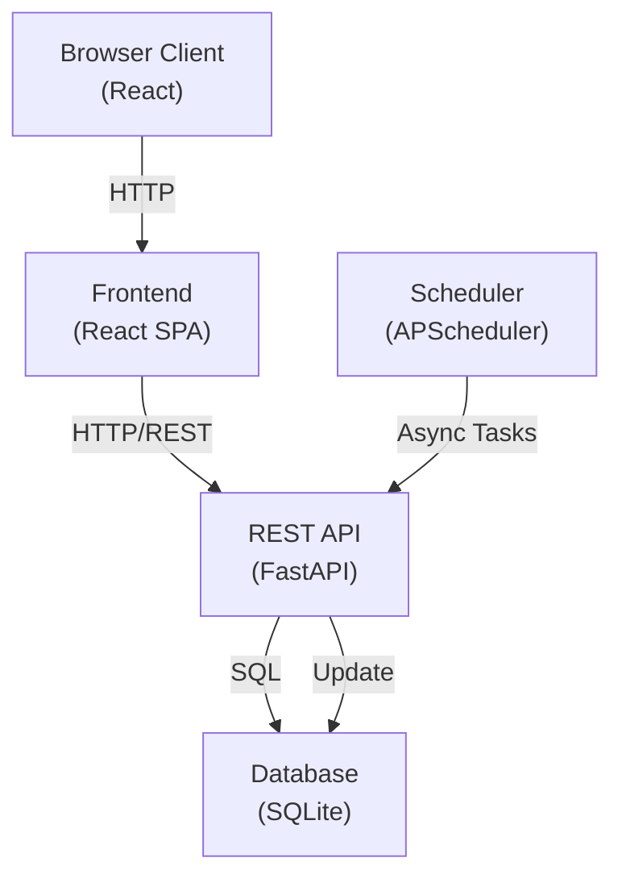

## Frontend Architecture

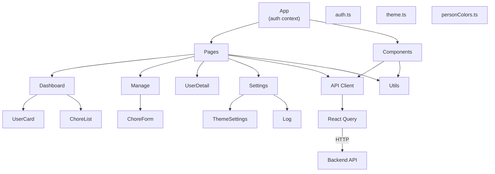

## Backend Architecture

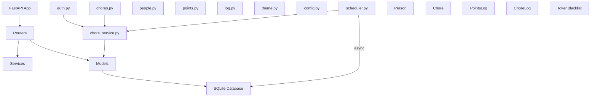

## Data Model

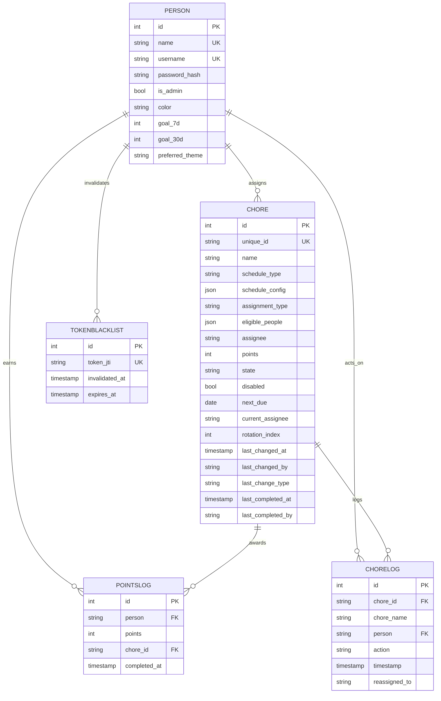

## Request/Response Flow

### Authentication

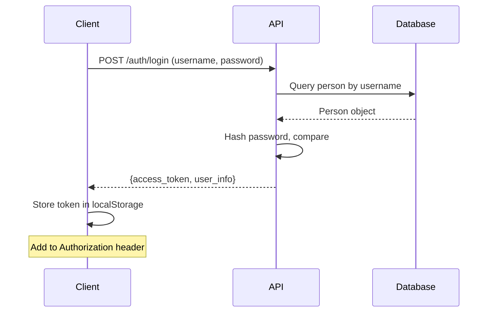

### Chore Completion

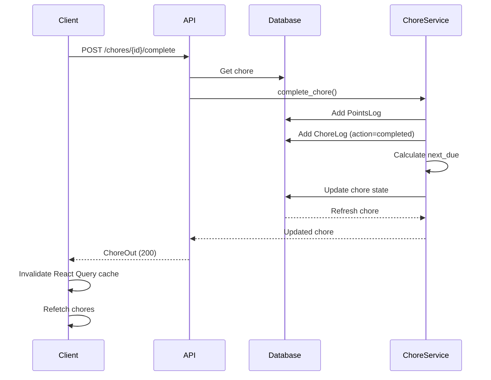

### Automatic Schedule Transition

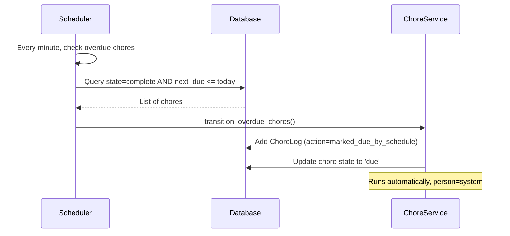

## Frontend Data Flow

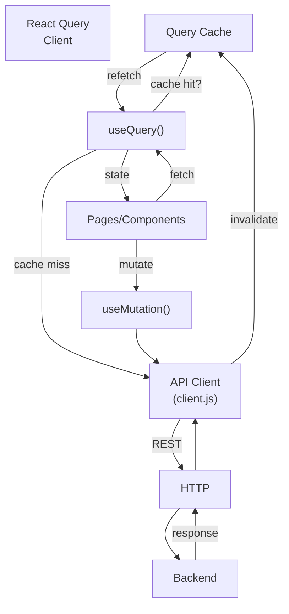

## Authentication Flow

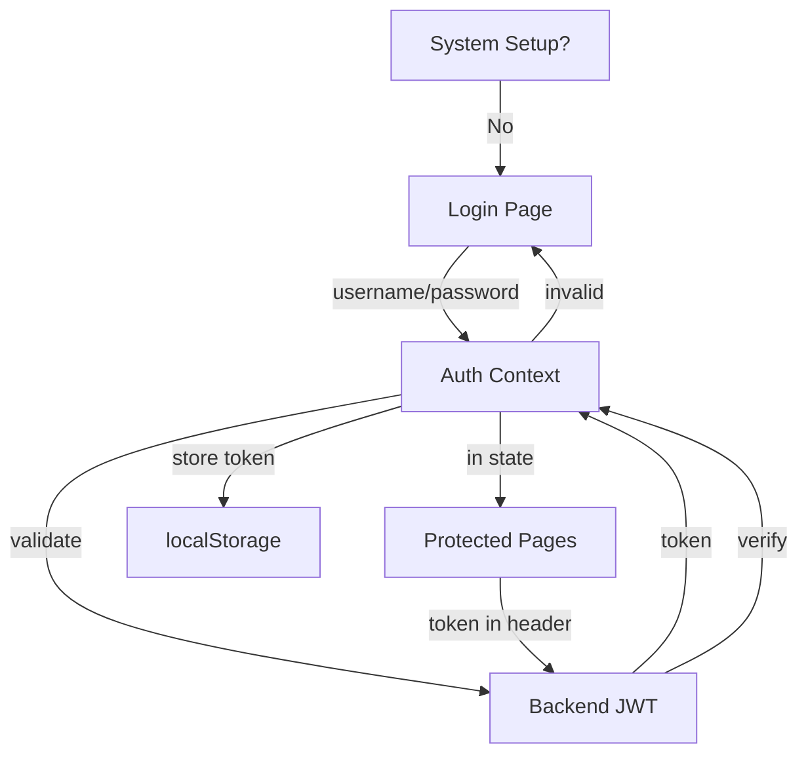

## Chore State Machine

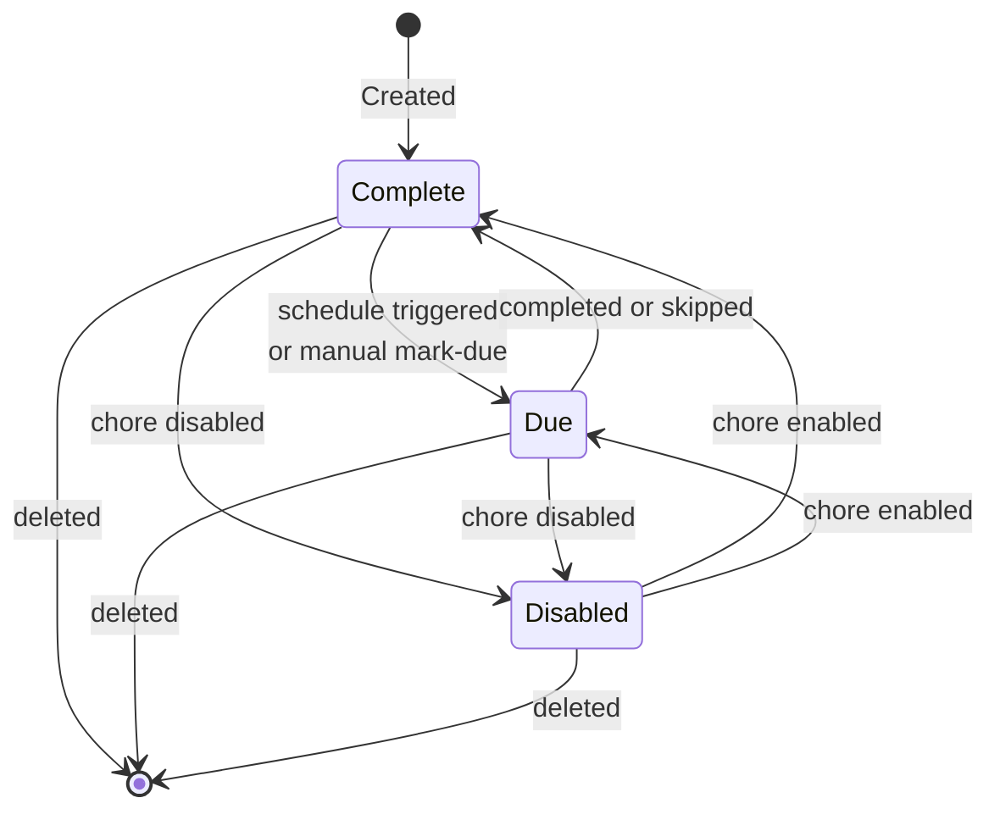

## Theme System

```mermaid
graph TB
    Frontend["Frontend<br/>(ThemeSettings)"]
    API["Theme API"]
    Memory["In-Memory<br/>Custom Themes"]
    Database["Database<br/>(Person.preferred_theme)"]
    
    Frontend -->|GET /theme/list| API
    API -->|DEFAULT_THEMES| API
    API -->|_custom_themes| Memory
    
    Frontend -->|POST /theme/save| API
    API -->|save| Memory
    
    Frontend -->|POST /theme/set/{id}| API
    API -->|save to| Database
    Database -->|return| Frontend
    
    Frontend -->|DELETE /theme/delete/{id}| API
    API -->|remove| Memory
    
    Frontend -->|CSS Variables| CSS["Styles<br/>--bg, --surface, etc"]
```

## Scheduler Architecture

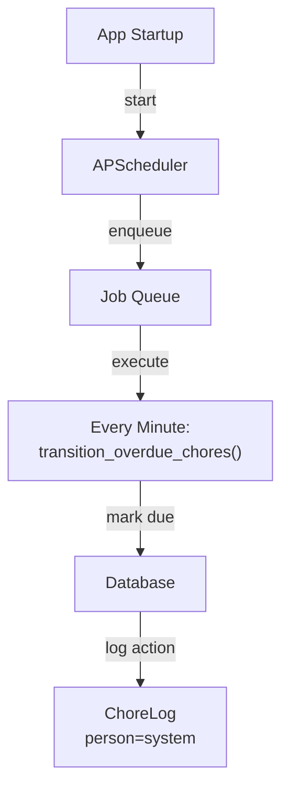

## Deployment Architecture

### Development

```
Frontend (npm dev)     -->  Backend (uvicorn)  -->  SQLite DB
http://localhost:5173     http://localhost:8000
```

### Production

```
Docker Compose:
  - frontend:3000 (Nginx)    -->  backend:8000 (FastAPI)  -->  SQLite
  - Backend initializes DB on startup
  - Scheduler runs inside backend container
```

## Security Considerations

1. **Authentication:** JWT tokens with 365-day expiration
2. **Password:** SHA256 pre-hash before bcrypt
3. **Token Blacklist:** InvalidTokenList in DB for logout
4. **CORS:** Configured for frontend origin
5. **Input Validation:** Pydantic schemas validate all inputs
6. **Admin Actions:** is_admin flag protects sensitive operations

## Performance Optimizations

1. **React Query:** Client-side caching of queries
2. **Query Invalidation:** Precise cache invalidation after mutations
3. **Async Database:** AsyncSession for non-blocking I/O
4. **Scheduler:** Single background process for system events
5. **Database Indexes:** unique_id, username, state, next_due (implicit)

## Future Scalability

- **Multi-user:** Already supports multiple Person records
- **Custom Themes:** In-memory store, could migrate to database
- **Logging:** ChoreLog ready, system events populated
- **API Clients:** Can be extended beyond React frontend
- **Real-time Updates:** WebSocket support could be added
