# Architecture

## System Overview

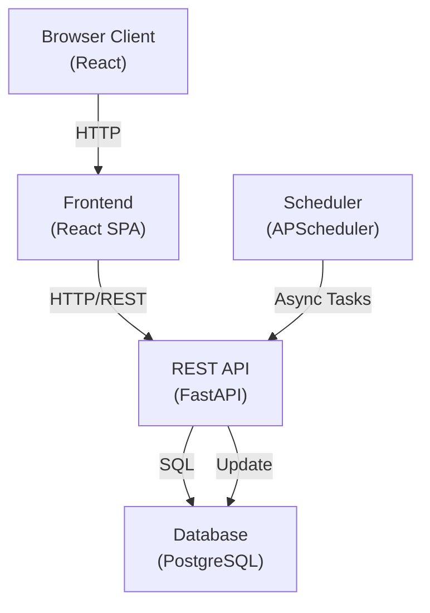

## Frontend Architecture

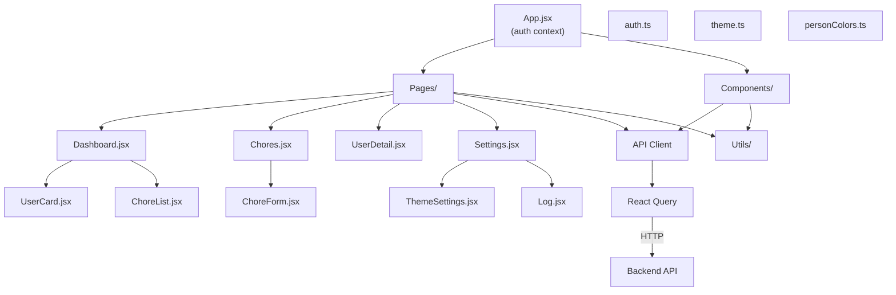

## Backend Architecture

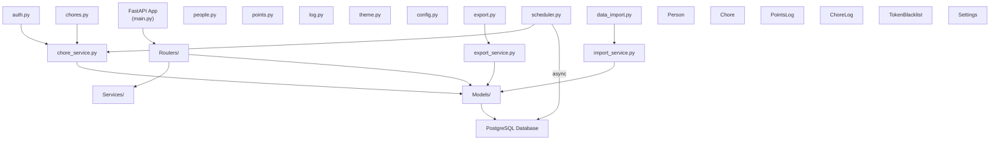

## Data Model

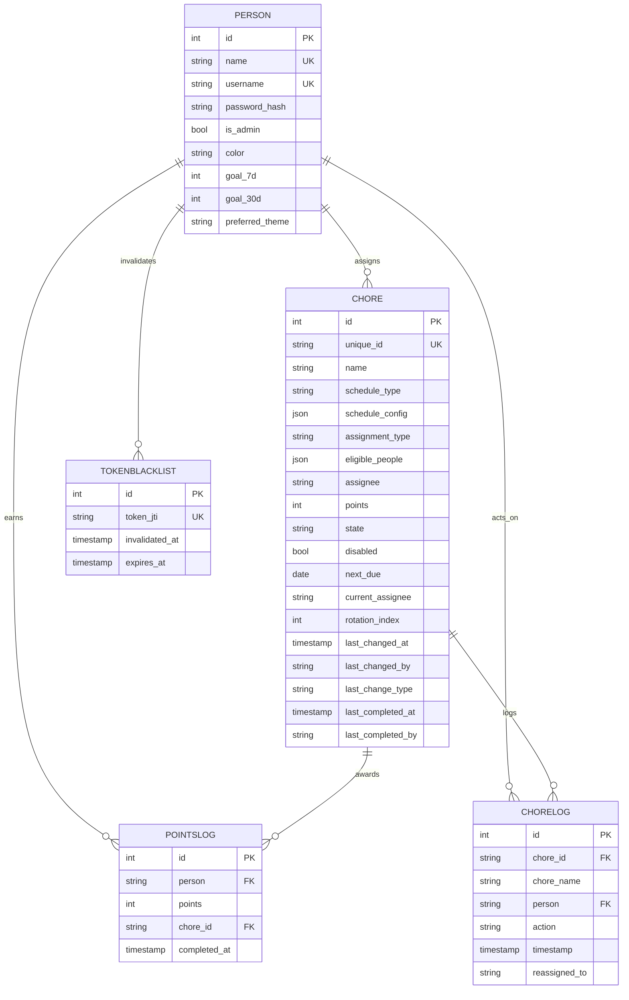

## Request/Response Flow

### Authentication

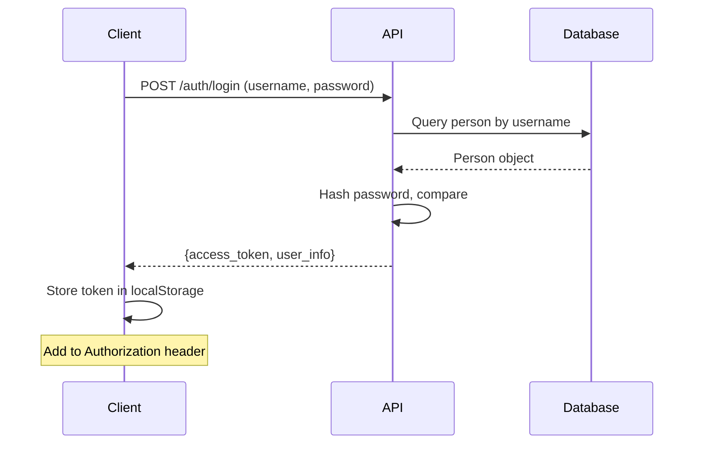

### Chore Completion

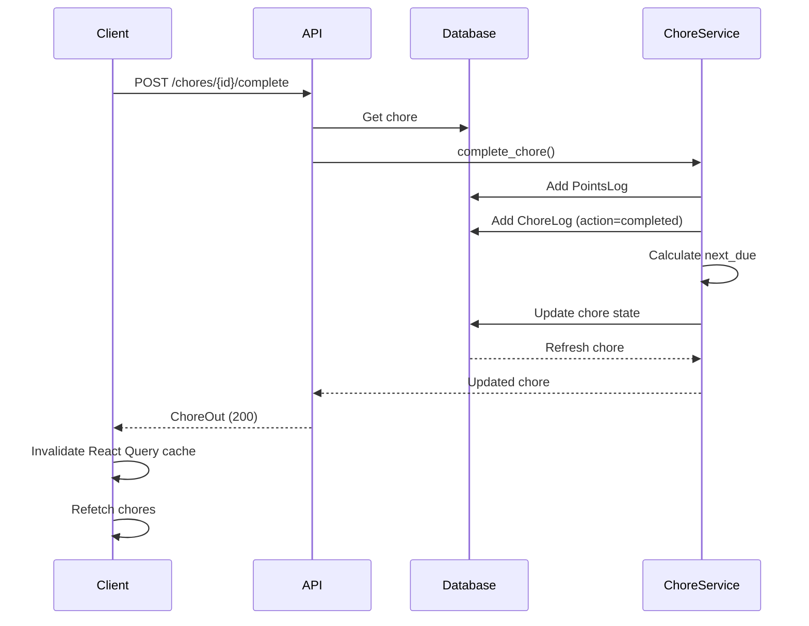

### Automatic Schedule Transition

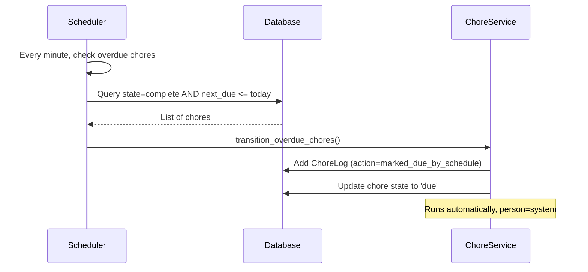

## Frontend Data Flow

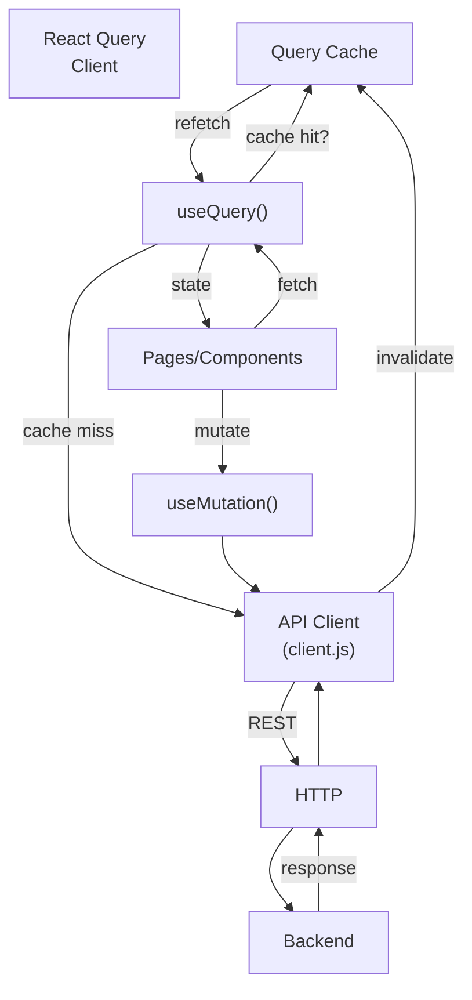

## Authentication Flow

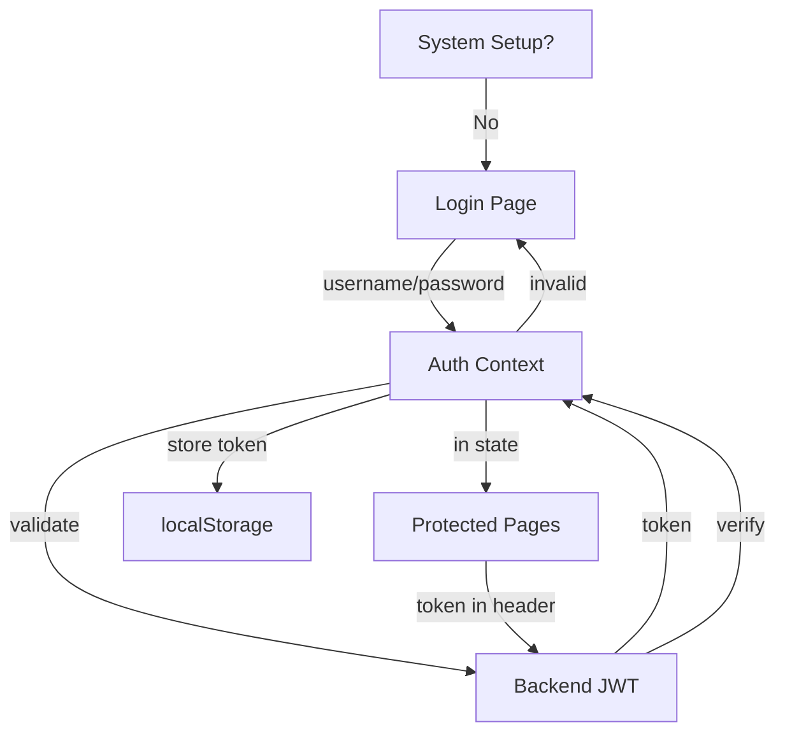

## Chore State Machine

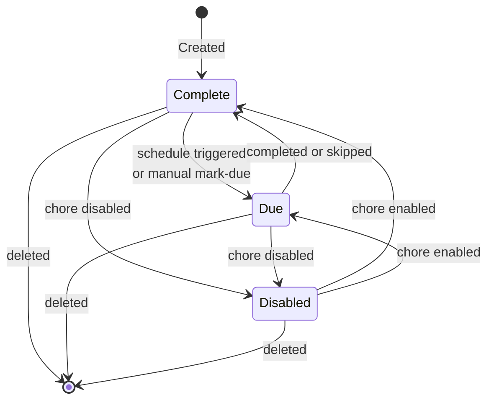

## Theme System

```mermaid
graph TB
    Frontend["Frontend<br/>(ThemeSettings)"]
    API["Theme API"]
    Defaults["DEFAULT_THEMES<br/>(hardcoded)"]
    Memory["Custom Themes<br/>(in-memory)"]
    Database["Database<br/>(Person.preferred_theme)"]
    CSS["CSS Variables<br/>(--bg, --surface, etc)"]
    
    Frontend -->|GET /theme/list| API
    API -->|fetch| Defaults
    API -->|fetch| Memory
    API -->|themes list| Frontend
    
    Frontend -->|POST /theme/save| API
    API -->|store| Memory
    
    Frontend -->|POST /theme/set/{id}| API
    API -->|save| Database
    Database -->|update| Frontend
    
    Frontend -->|DELETE /theme/delete/{id}| API
    API -->|remove| Memory
    
    Frontend -->|apply| CSS
```

## Scheduler Architecture

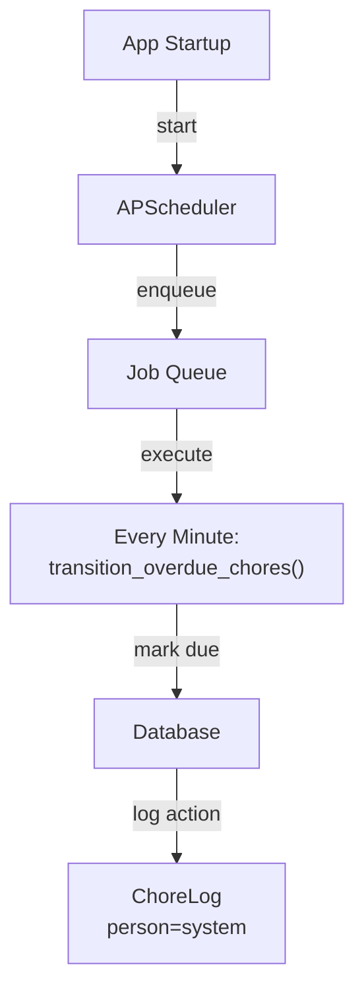

## Points & Scoring System

Points are awarded when users complete chores, with goal tracking over 7-day and 30-day rolling windows.

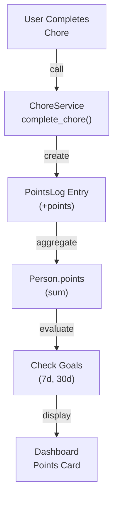

### Point Calculation

- **Award:** Chore completion = Chore.points awarded to person
- **Tracking:** PointsLog record created with (person, points, chore_id, completed_at)
- **Aggregation:** Person.points = sum of all PointsLog entries for that person
- **Goals:** Rolling 7-day and 30-day windows calculated from PointsLog timestamps
- **Reset:** Goals reset automatically at week/month boundaries based on completed_at timestamps

### Models

- **Person.points** – Total lifetime points (sum of all PointsLog)
- **Person.goal_7d** – Target points for 7-day rolling window
- **Person.goal_30d** – Target points for 30-day rolling window
- **PointsLog** – Transaction log: (id, person, points, chore_id, completed_at)

## Deployment Architecture

### Development

```
Frontend (npm dev)     -->  Backend (uvicorn)  -->  PostgreSQL
http://localhost:5173     http://localhost:8000
```

### Production

```
Docker Compose:
  - frontend:3000 (Nginx)    -->  backend:8000 (FastAPI)  -->  PostgreSQL
  - Backend initializes schema on startup
  - Scheduler runs inside backend container
  - Database persists in volume /var/lib/postgresql/data
```

### Development

```
Frontend (npm dev)     -->  Backend (uvicorn)  -->  PostgreSQL
http://localhost:5173     http://localhost:8000
```

### Production

```
Docker Compose:
  - frontend:3000 (Nginx)    -->  backend:8000 (FastAPI)  -->  PostgreSQL
  - Backend initializes schema on startup
  - Scheduler runs inside backend container
```

## Roles & Permissions

Two user roles with distinct capabilities:

### Admin Role
- Create/delete users
- Create/modify/delete chores
- Modify other users' settings and goals
- Export and import system data
- Access admin panel
- Perform all regular user operations

### Regular User Role
- View all chores and assignments
- Complete/skip assigned chores
- View personal points and progress
- Modify own settings and goals
- View audit log of actions
- Cannot create or modify chores
- Cannot manage other users

### Access Control

- **is_admin flag** in Person model determines role
- **Dependency injection** enforces auth checks via `get_current_user`
- **Route protection** via FastAPI `Depends(get_current_user)` on all protected endpoints
- **Admin-only routes** explicitly check `current_user.is_admin`

## Design Decisions & Rationale

### Database: PostgreSQL

**Why:** 
- Reliability and data integrity for multi-user households
- ACID compliance ensures consistency in point tracking and chore state
- Production-ready with replication options
- Scales better than SQLite for concurrent requests

**Trade-off:** Requires database server vs. file-based SQLite

### Scheduler: APScheduler

**Why:**
- Embedded scheduler (no external service required)
- Simple Python integration
- Automatic chore state transitions without manual intervention
- Runs in-process, no deployment complexity

**Trade-off:** Single-process scheduler, not distributed (sufficient for household use)

### Authentication: JWT with 365-Day Expiration

**Why:**
- Stateless authentication reduces server memory usage
- 365-day expiration provides convenience (no frequent re-login)
- Simple to implement in single-page application

**Trade-off:** Long expiration reduces security window; longer refresh token required for truly secure deployments

### Points System: Sum-Based Aggregation

**Why:**
- Simple, transparent scoring (points = effort)
- Historical tracking via PointsLog for audit
- Supports rolling window goals (7-day, 30-day)

**Trade-off:** No decay or weighting; old points count equally to recent points

### Frontend: React Query for State Management

**Why:**
- Client-side caching reduces API calls
- Automatic cache invalidation on mutations
- Optimistic updates improve perceived performance
- Handles loading and error states cleanly

**Trade-off:** Server-side state not shared across browser tabs (acceptable for household app)

### Architecture: Layered (Router → Service → Model → Database)

**Why:**
- Clean separation of concerns
- Testable business logic in services
- API contracts defined in schemas
- Easy to extend with new endpoints

**Trade-off:** More files/structure than monolithic approach

## Security Considerations

1. **Authentication:** JWT tokens with 365-day expiration
2. **Password:** SHA256 pre-hash before bcrypt
3. **Token Blacklist:** InvalidTokenList in DB for logout
4. **CORS:** Configured for frontend origin
5. **Input Validation:** Pydantic schemas validate all inputs
6. **Admin Actions:** is_admin flag protects sensitive operations

## Performance Optimizations

1. **React Query:** Client-side caching of queries
2. **Query Invalidation:** Precise cache invalidation after mutations
3. **Async Database:** AsyncSession for non-blocking I/O
4. **Scheduler:** Single background process for system events
5. **Database Indexes:** unique_id, username, state, next_due (implicit)

## Future Scalability

- **Multi-user:** Already supports multiple Person records
- **Custom Themes:** In-memory store, could migrate to database
- **Logging:** ChoreLog ready, system events populated
- **API Clients:** Can be extended beyond React frontend
- **Real-time Updates:** WebSocket support could be added
